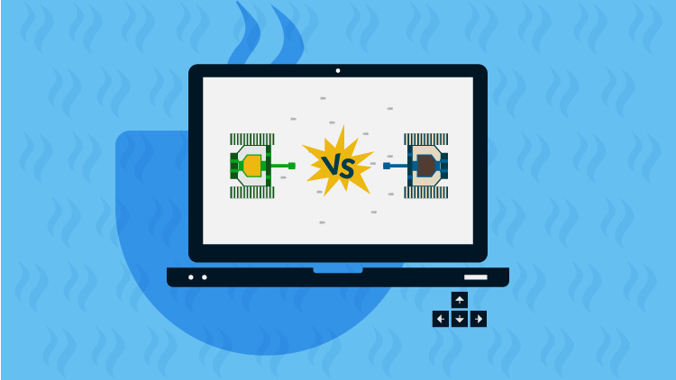

# Project: tankwar

<iframe width="360" height="202" style="position:absolute;top:0;left:0;width:100%;height:100%;" frameBorder="0" src="https://imgflip.com/embed/4ds2u8"></iframe>

<a href="https://imgflip.com/gif/4ds2u8">via Imgflip</a>

Using OOP concepts in Java programming language to implement a new version Tank War.

### Development Environment

To use IDEA community edition as IDE and JDK8 to compile code.

### Player Tank & Keyboard Control

* Player will control one tank by using keyboard with UP, Down, Left and Right and move it in eight directions. 
* When pressing SPACE and A respectively, the tank will fire a missile and trigger a SUPER_FIRE mode.  

### Enemy Tanks

* There will be 16 enemy tanks at the beginning. They will move and fire randomly. 
* If enemy tank was hit by a missile fired from player tank, it dies immediately and would disappear from the screen.
* If enemy tank fire a missile and hit player tank, it will reduce 20HP from player tank.  

### Explosion

* If a missile from player tank hit any enemy tank, or a missile from any enemy tank hit player tank, there should be  a explosion.

### Wall

* Simulate 4 walls, one in upper-middle, two in left and right, one in bottom-middle, If missile hit wall, it simply disappears. 

### Blood

* When player tank HP is lower than 20%, blood will appear. 
* If player tank eats the blood its HP will be restored to 100 immediately! 
* If blood was eat it will disappear.

### Optional

* You can search some more audio files for this game at here if you want: [https://freesound.org/](https://freesound.org/)

### Game Rule

* If player tank kill 100 enemy tanks, the screen displays YOU ARE WINNER. Game end.
* If player tank HP is equal or lower than 0, GAME OVER! Game end. 
* Press F2 to restart game.
* Tank will move with speed of 5, which means its x and y will either plus or minus 5.
* Missile will fly with speed of 10, which means its x and y will either plus of minus 10.

### Implementation Tips

* Design classes of `Tank`, `Missile`, `Wall`, `Blood`, and `Explosion`
* You can simply using `#fillRect` to draw walls with gray color, just calculate their locations
* To detect object collision, you can using `Rectange#intersects`, you can define a method `getRectangle`
for game objects for simple collision detection
* Write a enum `Direction` with 8 directions there(provided in skeleton code)
* Write a game client `TankWar`, with 800 * 600 screen, title and icon(image file provided `assets/images/icon.png`)
* Using a infinite loop to repaint the screen with interval of 50MS
* Change location of tank, missile, explode and implement draw method within these classes
* Git and Github are used to do Version Control.
